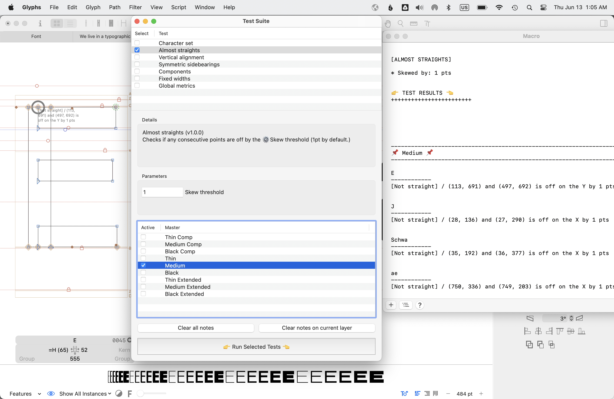

# QA Tool Suite
This repository holds the QA Tool Suite for the Glyphs application. It serves as a way to manage the quality assurance items agreed upon by the team and as an interface to run the relevant scripts. It is intended to check for consistency in the drawing of the font, surfacing issues that are best addressed directly within the application. For QA of technical standards, we recommend using Terminal-based tools such as [font bakery](https://github.com/fonttools/fontbakery). 

This is essentially a UI framework for organizing and running scripts for quality assurance checks. These are often specific to the project and foundry, so the tool would work best if you developed your own python scripts to include in the suite. 
Glyphs has great tutorials on [getting started with scripting](https://glyphsapp.com/learn/scripting-glyphs-part-1).

> Note: The QA Tool is for detection, not fixing: it will only report on issues and will never change anything in your font file. If you find that there is a pattern of issues you may want to address programmatically, you will need to write separate scripts for them.

(This tool is currently structured as something that can be installed within the `Glyphs Scripts` folder, with the intention that writing test scripts will be easier if you can easily `Reload Scripts` to update the Suite. With the latest versions of Glyphs however, it looks like this is no longer the case, and you may need to restart Glyphs to reflect edits to your QA tests.)

## Getting Started

### Installation
Clone this repository into the Scripts folder of your Glyphs application.

Usually, the path to your Glyphs scripts folder is:
`/Users/*yourusername*/Library/Application\ Support/Glyphs/Scripts`

## Usage


> You should have a font file open before launching the tool. For now, relaunch your tool when running for a different font (in order to load the correct default parameters)

1. Select the font to run QA. It will only run on the selected font.
2. Launch the QA Tool via `Script > QATool > Test Suite`
3. Select a test or multiple tests from the list
4. Verify the default parameters or enter in your own
5. Hit *Run Selected Tests*. Problematic glyphs will be raised in the Macro Panel. For each master, a new tab will open with glyphs annotated with issues as well.

## The Report 
There are two types of outputs for the QA Report: **Notes** and **Results**.

### Notes
All notes will be displayed first under REFERENCE. Notes are useful for printing out the parameters used for running tests, or for references across multiple masters.

```
REFERENCE
++++++++++++++++++++++++

Notes
...
```

### Results
All results are consolidated under TEST RESULTS.
They are organized first by master, then by glyph name.
If multiple tests are run, results are consolidated together under each glyph.
```
TEST RESULTS
++++++++++++++++++++++++

------------------------------------------------------------------------------------------
Master Name
------------------------------------------------------------------------------------------

Glyph Name
------------
[Test Label] Result description

...
```

## Supporting Scripts + Keyboard Shortcuts

Because the QA Tool opens a tab with glyphs that have issues, it’s useful to have the [Edit Next/Previous Glyph](https://github.com/justanotherfoundry/freemix-glyphsapp) scripts by Tim Ahrens installed with keyboard shortcuts assigned.

The tool has a button to clear QA annotations applied on each glyph, but it’s probably nicer to have a shortcut to it too.
Here’s a script you can install in your scripts folder for clearing a note on the current layer.

```python
#MenuTitle: Delete Annotations on Current Layer
# -*- coding: utf-8 -*-
__doc__="""
Removes annotations applied on the currently selected layer
"""

layer = Glyphs.font.selectedLayers[0]
layer.annotations = None
print(u"Notes on %s[%s] removed ✨" % (layer.parent.name, layer.name))
```

Then, you can go through the Edit View, cycling through each glyph, addressing any issues and removing annotations as you go.

## The Tests

### Structure
All tests inherits the constructor `scripts > abstracts > task.py`. The test must follow this template to execute properly from the tool. If no parameters exist for the test, return an empty list `[]`.

```python
# -*- coding: utf-8 -*-
from GlyphsApp import *
from vanilla import *
from abstracts.task import QATask


class Script(QATask):
	"""Test description goes here"""

	def details(self):
		return {
			"name": "Test name",
			"version": "1.0.0",
			"description": "This description will display in the detail view"
			}


	def parameters(self):
		return [
			("Parameter Name": "Default value")
		]

	def run(self, parameters, report):

		default = parameters[0][1]
		report.note("\n* Parameter Description: " + default + "\n" )

		for m in self.masters:
			for g in self.glyphs:
				report.add(m.name, g.name, 'Heading', 'Description', passed=False)

```


### Test Objects

For convenience, a few objects set up to be available for any test:
- `self.font` Glyphs font object
- `self.masters` All masters within the font
- `self.glyphs` All glyphs within the font

Access the [Glyphs API](https://docu.glyphsapp.com/index.html) for the Glyphs object model.


### Log a Note
**report.note**(string)

Notes do not inherently have a pass/fail status. They are good for noting parameters and reference points for a test and will appear under `REFERENCE` on the final report output.

- `string` (string) any text


#### Code
```python
report.note("* Some message for reference")
```

#### Output
```
* Some message for reference
```


### Log a Test Result
**report.add**(master, glyph, header, desc, passed)

Use this method when reporting a test result. This does 2 things: 
1. Logs a line item under `TEST RESULTS` on the final report output.
2. Adds the description text as an annotation onto the glyph. If there is a specific point included in the description, it will attach the annotation to that point; if not, it will attach the annotation at the top left corner of the glyph.

- `master` (string) The name of the master
- `glyph` (string) The name of the glyph 
- `header` (string) The test label. Appears on the report within brackets `[header]`
- `desc` (string) The test result description. \* Integers must be a converted to string values for concatenation
- `passed` (Boolean) Whether the test passes or fails. Set it to `False` for failed tests, `True` for passed tests.
 

#### Code
```python
report.add(m.name, g.name, 'Overkerns', 'Positive kerning', passed=False)
```

#### Output
```
[Overkerns] Positive kerning
```

### Helper: Format a Point
**report.node**(GSnode)

Use this method to format Glyphs NSPoint Objects such as points, nodes, anchors, or other objects with x and y values. This should be used within the above Log methods.

- `GSnode` (Glyphs point object) Any NSPoint object


#### Code
```python
report.add(m.name, g.name, 'Not straight', "/ %s and %s is off on the X by %i pts" % (report.node(point), report.node(prev_point), skew), passed=False )
```

#### Output
```
[Not straight] / (438.0, 240.0) and (439.0, 288.0) is off on the X by 1 pts
```


## Maintenance

### Test Updates
Additional tests can be added by:
1. Writing a test in the predefined format noted in Structure above.
2. Adding the test to the **scripts** folder within the respository.
3. Add the exact test name defined in the test details in the **test_order.txt** file. You can rearrange the order of the tests here.


### Tool Updates
All feature requests and issues of the tool itself are handled in [Github issues](https://github.com/morisawausa/QATool/issues).
Please tag each issue with relevant labels and with the [QA Tool Updates](https://github.com/morisawausa/OccQATool/projects/1) project. This is where issues will be tracked for futher versions of the tool.


